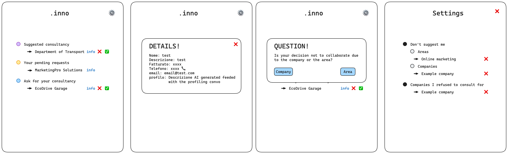

# Registrazione azienda
1) Compilazione `general info`: 
	- sei una B2B o solo una B2C
	- nome
	- descrizione del servizio che offri
	- contatti
	- fatturato
2) Profiling
3) **Case B2B:** AI cerca per match tra la descrizione e i vari profili delle aziende a cui suggerirsi come consulente
	- Controlla se passa i seguenti filtri:
		- Non è presente come azienda in `consulenze.disliked-incoming`
		- L'area in cui potrebbe intervenire l'azienda di consulenza (AI generated) non è presente in `consulenze.accepted`
		Nel caso ci si aggiunge a `consulenze.suggested` dell'azienda a cui ci si sta offrendo


```json
{
	"Aziende": [
		{
			
			"name": "EcoDrive Garage",
			"descrizione": "Officina meccanica specializzata in riparazione e manutenzione di veicoli elettrici",
			"telfono": "3701315527",
			"email": "ecodrive@hack.com",
			"fatturato": 18183,
			"consulenze": {
				"suggested": ["Azienda che si propone come consulente"],
				"pending-outcoming": ["Azienda a cui ho chiesto consulenza e sto aspettando una risposta"],
				"disliked-outcoming":{
					"area":["Area a cui non sono interessato a investire"],
					"companies":["Compagnia a cui non voglio chiedere consulenza"]
				},
				"disliked-incoming": ["Aziende da cui non voglio ricevere offerte di consulenza"],
				"accepted":[
					"Areas in which he already invested"
				]
			},
			"profile": [
				{
					"domanda": "Qual è il principale tipo di servizio che offri?",
					"risposta":"Riparazioni e manutenzione di veicoli"
				},
				{
					"domanda": "Qual è il tipo di clientela che serve principalmente la tua azienda?",
					"risposta":"Proprietari di veicoli privati o aziende con flotte di veicoli"
				},
				{
					"domanda": "Quali dei seguenti strumenti e attrezzature utilizzi di più nella tua attività?",
					"risposta":"Diagnostica elettronica per veicoli e attrezzi di riparazione"
				}
			]
		},
		...
	]
}
```


# Home page



## Suggested consultancy
- Caso utente **conferma**:
	- `{name,descrizione,fatturato, profile}`  vengono passate all'AI per generare un report da inoltrate all'azienda di consulenza
	- **Commento:** in questo modo si facilità la vita al consulente
	-  L'area in cui interviene l'azienda di consulenza viene aggiunta a `consulenze.pending-outcome`
- Caso utente **rifiuta**:
	- Chiede se ha rifiutato perchè non è interessato a collaborare con quel consulente o per l'area d'investimento
		- Caso **Area**: l'area in cui sarebbe intervenuta l'azienda di consulenza (AI generated) viene aggiunta a `consulenze.disliked-incoming.area`
		- Caso **Company:** la l'azienda di consulenza (AI generated) viene aggiunta a `consulenze.disliked-incoming.company`


## Ask for your consultancy
- Notifica la tua decisione all'azienda che ha richiesto la consulenza tramite **WhatsApp** o **email** e la rimuove dalla mia lista
- Si rimuove da `consulenze.pending-outcoming` dell'azienda che ha richiesto la consulenza e si aggiunge a `consulenze.accepted`